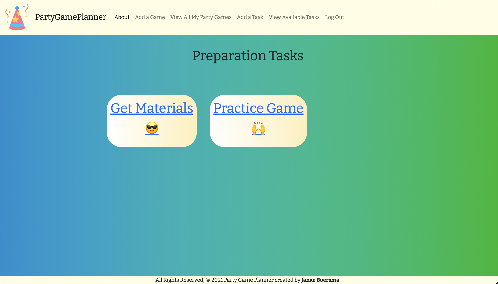

# Party Game Planner
### Where you plan the games you can play with big groups at parties

## Description
Party Game Planner was developed with the goal of allowing users to store their ideas for party games that big groups can play.  In this app the user can add games, the parties where they plan to play the game and add different tasks that they will need to do to plan for their game. This app was developed in one week during my time at General Assembly as a Django project.

## Getting Started

Deployed Site: https://partygameplanner.herokuapp.com/

Trello Board: https://trello.com/b/ZIGfWnXK/party-game-planner

## Screenshots

***

### Landing Page

***

### About Page

***

### Login Page

***

### Add Game Page

***

### Game List Page

***

### Game Detail Page

***

### Add Task Page

***

### Task List Page

***

## Technologies Used:

* Python
* Django
* PostgreSQL
* Amazon AWS
* Trello
* Heroku
* HTML
* CSS
* GitHub
* Git

## Additional Resources Used:

* Trello
* Whimsical
* Visual Studio Code
* FontAwesome
* Bootstrap
* Google Fonts

## Credits:

* [Chris Smith](https://codepen.io/chris22smith) for the animated background
* [ColorSpace](https://mycolor.space/gradient?ori=to+top&hex=%2343AA8B&hex2=%23713E5A&sub=1) for the gradient background
* Icon made by Good Ware from https://www.flaticon.com
* Gif from https://www.giphy.com

## Next Steps:

* Allow users to see other user games and comment on them
* Allow users to friend other users
* Allow users to see all of the games and filter through them
* Allow users the ability to delete parties and photos
